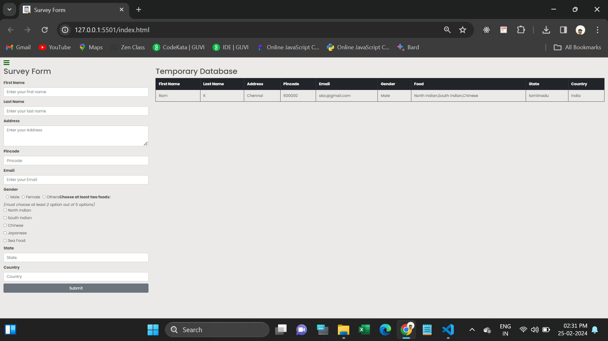

<h1>Survey Form</h1>

This webpage is used to store Survey details.

If fill the form after it stored in table

It performs like temporary database.

I was used Html, CSS, Bootstrap, Javascript for developing the page

I was created all the Html elements using Javascript DOM.

I attached Webpage link and screenshot below..
 

<h1>Website Link</h1>
https://user-survey-form.netlify.app/

<h1>Website Screenshot</h1>

Main page:

Data stored in table:

